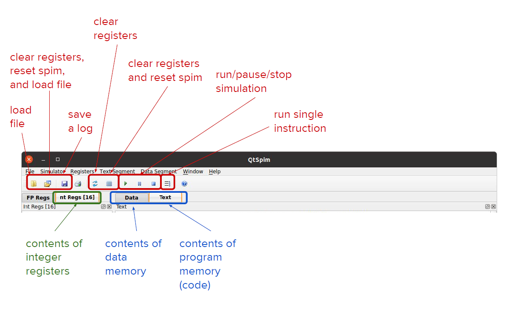
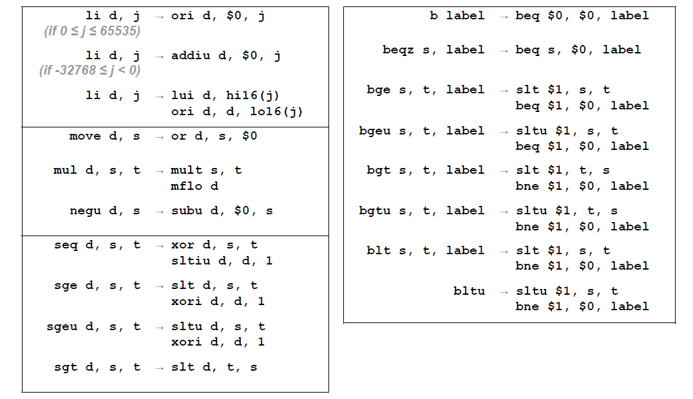

# SPIM

- `FP Regs`: floating point registers (out of scope)
- `Int Regs[16]`: contents of all integer registers
- `Data`: Contents of **data** memory (store/load)
- `Text`: contents of **program** memory (your instructions)
    - By the time you assemble it, it will be stored in a section of data.
- **Reset spim** takes out all `Data` and `Text` memory

## Interface
### Registers
- Number: 0-31, how machine interacts with the registers
- Name: human read
- Current register content (most initialized 0)

On top, a few registers containing pointers
- `PC`: program counter (address of currently executing instruction)

### Instructions (`Text`)
```mips
jal 0x00000000 [main]
```
Jumps to `main`, where you start with. If no `main`, error!

- Right: source file instructions (your MIPS code)
- Middle: intermediate instructions
- Left: binary encoding (each instruction is a 32-bit wide bitstring in HEX)
- Left most: memory address of instruction (stored in `PC` at execution time)

### Memory (`Data`)

- Left: address
- Middle: data in hex representation
- Right: data in ASCII representation

### Pseudoinstructions


## E. `strlen`
String storage in memory: ASCII bytes with `NULL` terminator

Need a pointer to the first element `$a0$`, increment it, until hitting `0`.

## Subroutine
aka function

After executing, **resumes whatever invoked it**

Useful for 
- Code reuse
- Isolation/abstraction
- Recursion

Changes program control twice
1. Function call: `jal` (jump and link), 
    - Saves the **return address** in `$ra` 
    - Jumps to the function
2. Function return: `jr $ra` (jump register)


```c
// Example of call tree
int main(int argv, char **argc){
    for (i = 0; i < 3; i++){
        mysub(i);
    }
}
void mysub(int x){
    myleaf();
}
void myleaf(void){
}
```
One of the **branches** is in-progress: called the **stack** of **active** funciton invocations (Example: `main()`, `main()/mysub(0)/myleaf()`)

In MIPS, **call stack** lives in memory. Pointer `$sp` points to the top of the stack, and stack grows **down**

Example: nested function call: want `A` to call `B`, which calls `C`
Don't want return address `$ra` to be overwritten
```mips
A: 
    addi $sp, $sp, -4   # allocates space on stack
    sw $ra, 0($sp)      # saves original return address to stack

    jal B
    # Now $ra overwritten, but saved already    

    lw $ra, 0($sp)      # retore original return address
    addi $sp, $sp, 4    # de-callocate space on stack

    jr $ra

B: 
    addi $sp, $sp, -4   # same thing here
    sw $ra, 0($sp)

    jal C

    lw $ra, 0($sp)
    addi $sp, $sp, 4

    jr $ra

C: 
    jr $ra              # C calls nothing, no need to S/L 
```

## Complete MIPS Addresss space
- Kernel level
    - reserved, memory mapped IO, kernel data, kernel text
- User level
    - Stack segment (size variable)
    - ... (collide: out of memory/stack overflow)
    - Dynamic data (**heap**, size variable)
    - Static data (data constant **size** when program is written (E. string))
    - Text segment
- Kernel level
    - reserved

## Calling conventions
ISA only have 32 registers, but some functions that need the same registers.

### Caller view
Put any **arguments** in `$a0`, `$a1`, `$a2`, `$a3`
```mips
jal mysub
```
When control returns, **return value** in `$vo`, `$v1`
- `$s0`, ..., `$s7` (saved registers), `$gp`, `$sp` (stack pointer), `$fp`, `$ra` (return address) unchanged
- `$a0`, ..., `$a3`; `$t0`, ..., `$t9` (temporary) may be **overwritten**. Anything that I want to save should be put in `$s` registers

### Callee view
Entry point: 
- `$ra` holds return address
- `$a` are the first 4 args
```mips
mysub:
    # body of subroutine
jr $ra
```
Return:
- `$v` holds the result
- `$s`, `$gp`, `$sp`, `$fp`, `$ra` **restored** to values in entry (using stack)

### Example: recursive `strlen()`
(a function is both caller and callee)
```mips
strlen:
    # if first character is null, go to base case
    lbu $t0, 0($a0)             # load byte unsigned from memory
    beqz $t0, strlen_basecase   # if = 0

    # otherwise, recurse
    addi $sp, $sp, -4           # alloc word on stack
    sw $ra, 0($sp) 
    addi $a0, $a0, 1            # advance STRING pointer
    jal strlen                  # recursive call

    # eventually after base case, will end up here
    addi $v0, $v0, 1            # add 1 to length
    lw $ra, 0($sp)              
    addi $sp, $sp, 4         
    jr $ra

strlen_basecase:
    # return 0
    li $v0, 0
    jr $ra
```

## Strored program
Instructions are encoded and stored in memory.

No need to rewire


In MIPS, 3 formats, all necodings 32 bits wide
- R-type: register operands (3 registers)
- I-type: immediate operands (2 registers + 1 imm)
- J-type: for jumping

Fewer formats are simpler and faster

### R-format
Example: `add, $s0, $s1, $s2`
|Name   | Meaning   | Size  | Example | Example (dec)|
|---    |---        |---    |---    |---    |
|`op`   | opcode   | 6     | `add` | 0     |
|`rs` | source register | 5 | `$s1` | 17    |
|`rt` | source register | 5 | `$s2` | 18    |
|`rd`   | destination register | 5 | `$s0`  | 16
|`shamt`| shift amount (usually 0) | 5 |   | 0
|`funct`| used together with `opcode` | 6 | `add`   | 32


### I-format
Example 1: `addi $t0, $s3, -12`

Example 2: `lw $t2, 32($0)`
| Name  | Meaning   | Size  | E1  | E1 (dec)    | E2    | E2 (dec)
|---    |---        |---    | --- | ---         | ---   | ---
|`op`   | opcode    | 6     | `addi`    | 8     | `lw`  | 35
| `rs`  | source reg | 5     | `$s3`      | 19     | `$0` | 0
| `rt`  | flex reg   | 5     | `$t0`     | 8    | `$t2` | 10
|`imm`  | immediate | 16    | -12     | -12    | 32  | 32

 
`rt` is sometimes source, sometimes destination. `rs` always source, `rd` always destination

**`beqz`** is also I-format. Compiler replaces label with offset (go x instructions forward)

### J-format
| Name| Meaning |Size | 
|---|---|---|
|`op` | opcode | 6| 
|`addr`| **middle** of target address| 26| 

26 bit to 32 bit
- Reuse the top 4 bits (limit on how far you can jump)
- End 2 bits always `00`, since instructions always start address of **multiples of 4**
