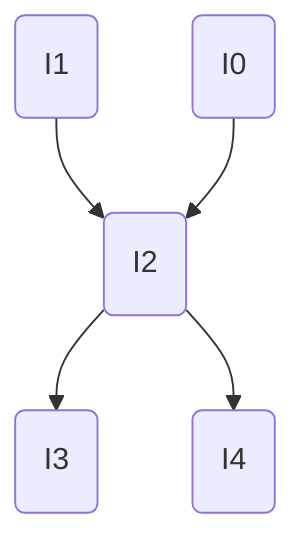




# Pipeline
Physical implementation may have multiple stages **pipelined**
- F (2 stages)
- D (1)
- RR (1)
- X (3)
- RW (1)
Add more **pipelines**, executing multiple instructions in parallel!
- Write parallel programs -> **request** level parallelism

### Depth Limit
Diminishing returns on FF setup hold. 
> Let delay be $$L$$, split into $$k$$ stages, latch overhead be $$o$$, 
> $$t_{clk}(k) = \frac L k + o$$

# Super Scalar (in-order)
Executes <span style="color:rgb(255, 0, 0)">multiple</span> instructions per cycle (pipeline + <span style="color:rgb(255, 0, 0)">parallel</span> per stage)
- In fetch stage, **fetch** n instruction.
- Decode n
- Read 2n from register read
- execute, writeback

Need
- Hazard detection
- Load/store queue for memory ordering
	- Register renaming
- Branch prediction

**Parallel**
Let compiler optimize it. Compiler will package them to <span style="color:rgb(255, 0, 0)">parcels</span>
- VLIW machine (Very Long Instruction Word)
- Compiler need to package independent instructions into parcels that can be all executed at once
- If can't parcel, leave slots as **empty**, cut off the parcel

## Instruction Level Parallelism (ILP)

```c
for (int i = 0; i < n; i++) {
	result += x[i] * y[i]
}
```

Unroll dot product to extract parallelism (done by compiler), as long as you know what `n` is

```c
for (i = 0; i < n-4; i+=4) {
	result += x[i] * y[i]
	// ...
	result += x[i+3] * y[i+3];
}
```

## Simple in-order Superscalar machine
**Superscalar** pipeline: IF, ID, RR, EX, WB (**x4**, 4-way)
- Only need 1 IF, which emits 4 instructions **simultaneously** (cache locality)
- Still need 4 ID for 4 instructions
- Register file needs a different architecture
	- Forwarding logic (will be complicated, since need to consider 4 EX units)
- 4 EX
- 4 WB (need 4 ports)

### Solutions
- Beef up the HW
- Compiler optimization in SW
- Branch prediction optimization
	- If diminishing returns, use parallelism

### Fetching
- Input: program counter (x4)
- Output: the instruction (x4)
We have the **instruction cache** (E. 64B lines, each instruction is 4B wide. You read 16 instructions at once). In scalar pipeline, you only use one of the 16

In a superscalar pipeline, you can use all 16 (more at same cost)
- In case of jumps, only a *subset* of the fetched ones will execute
- **Solution**: Still execute, and throw away the stuff not needed (**predicated** execution)
	- Or branch prediction

#  VILW
Very Long Instruction Word, compile instructions into **independent blocks**
- Simple hardware
- Compiler does scheduling
	- If compiler does good static analysis
VLIW processor, given a control flow graph, look all **all** instructions within one basic block, put into a single **packet**

## Blocks
- **Basic block**: any *single-entry*, *single-exit* region of code
	- E. `if (cond) {//A} else {//B}`
	- Only way to jump to the start is through the condition
	- Only way to exit are the ends of the block, if no other condition statements in A and B.
- Arrange of basic blocks are **control flow graphs**
- **Data flow graphs**: link operations by **true** data dependencies **within** a block


### Super Block
E. `P -> A/B -> C` becomes **tail duplicated** to `(P A C) (P B C)` (two packets)
- Now multiple exits. If you want to jump to the B block, needs to exit again
- Eliminates control flow, linear code
Drawback: increased code size

### Hyperblock
Also duplication, but for<span style="color:rgb(255, 0, 0)"> small branches</span>, do **predication** (if conversion)
- For a branch, execute **both sides**

Compilers have limited scope to optimize. Need **dynamic scheduling** at runtime to assign instructions to execution units
- How out-of-order superscalar processors do speculate the next code to execute.

### Drawback
- Large code size
- Can't handle unpredictability well
	- Memory aliasing (tell if they are dependent)
	- Branches
- Execution may be wasted

# Speculation
Branching types: need a condition and target
- Conditional: branching
- Unconditional: jump
- Direct: specified as part of the instruction (immediate, PC relative, PC is available in the first pipeline stage)
- Indirect: specified from a register (more dependency)


- If wrong prediction, cause 3 bubbles in the pipeline
- Only $$\frac 2 5$$ IPC, due to 3 cycles wasted
- Need to predict both the **condition** and the **target**

## Procedure
- Store a big table of branch PC
- When fetching a PC, consult this table, and find the target PC
- How to *validate* a guess? **Identify** the ground truth
	- For unconditional (jump), remember the `jmp` target. Check if target matches with the next address
	- When `jmp` is in RR (target read), compare with the next address
	- (Wait for the oldest instruction in the pipeline to be **non-speculative**)
- Fix the branch predictor if needed

## Implementation
1. Local history conditional predictor
	- Infer with previous outcomes of the **same** branch

```c
for (int i = 0; i < a; i++)
	for (int j = 0; j < b; j++)
		// ...
```

- Lookup table that takes n bits from the PC. Store one **or more** bits on if the branch is taken
	- Can fit $$2^n$$ bits
		- 1 because can store even further histories (**hysteresis**)
	- E. If taken/not taken twice, then change prediction

```c
counter[PHT_SIZE];           // 2-bit saturation counter
hlen history[HIST_TABLE_SIZE];    // local history for each

bool predict (unsigned long long int pc) {
	unsigned int histIndex = pc & (HIST_TABLE_SIZE - 1);
	unsigned int phtIndex = history[histIndex];
	return counter[phtIndex] & 0x2; // 0, 1: not taken; 2, 3: taken
}
```

## Target Buffer
- Hash the PC into a tag. 
- Compare if tag matches a PC. 
	- If so, jump to target address
Lookup happens in **parallel** with branch address decode


MUX from various sources (**sel** based on heuristic. If something **hits** in BTB or RAS, prioritize them)
1. MUX: Select bit from **branch predictor**
	- Branch Target Buffer, or
	- Next sequential fetch address
2. Return address stack (RAS)
3. Next fetch address from branch misprediction or exception (outside of fetch)

### Scalability: Little's Law
Deeper pipeline:
- Higher frequency
- More in-flight instructions
- More in-flight branches
	- Need high branch predictor accuracy

> E. 20-stage processor, 4-way superscalar. Can have 80 instructions in flight
> 	Reorder buffer size: 80
> 	Fetch: 8 inst/cycle / 4 = 2 branches / cycle needed
	
**Fetching** from instruction cache
- Instruction may be in different blocks in I cache
- I cache needs to be **multi-ported** (slow)
**Decode**: relatively easy for RISC, but CISC can have multi-bit instructions
- CISC converts CISC ops to RISC ops, put them in trace cache
**Register Renaming**: 8 instructions at a time
- Issue queue
**Execution Unit**
- Reading operand is hard. Need to read from RF
- RF needs to be large. Practically split to multiple cycles
- Forwarding: Every execution unit needs to send value to every **other** unit (nxn crossbar, hard to scale)

## Return address Stack
Hard to predict, since a function can be called from **different places**
Luckily, calls and returns have special **semantics**

- Push callee's next *sequential* address into stack
- When return, pop the stack, and use this address as my next **prediction**
	- Allows storing multiple target addresses from the same PC (function)
- Mispredictions
	- If stack overflows, some entries are overwritten
	- Wait for the return to be non-speculative. Then compute the address

Two pieces: address stack and link stack
1. `call` commit
	1. Update call target address in Call Target Buffer (CTB)
	2. Push CTB index on `RAS` link stack
2. Return commit
	1. Pop CTB index

## Summary


### Global History Predictor
Outcome of a branch is typically related to **previous** outcomes of **other** branches

```c
if (cond) a = 2;
// ...
if (a == 0)  // ...
```

- Hash 30-40 bits of branch history with PC, and store in a table to lookup
Use another **meta**predictor to decide whether to use a local/global predictor

### Neural Branch Prediction
Online supervised machine learning 
- **Online**: not pre-trained
- Make and remember the guess
- Check if guess is correct
- If guess is wrong, flip prediction next time


Simple neural network (single layer, single node)
- Take PC hash to get one set of weights
- Look up the table of model weights
- Multiply each weight with global history register
- Sum each neural branch to a function

**Update**
If match, go to the register history.. Increment every branch where `i == outcome`

### Example
```c
for (int i = 0; i < 100000; i++) {
	array[i] = 1 % 5;
	if (i % 2 == 0)
		// do something
	else
		// do else
	
	switch(array[i]) {
		case 0:    
			// something 
			break;
		case 1:
			// something
			break;
	}
	
	func();
}
```

**Control flow transfers**
- `for` loop
	- Local history (always predict not taken, so you `for` constantly)
- `if`
	- Local history with hysteresis
- `switch` (5 branches)
- `func()` (unconditional)

Case statement loads to a jump table

```
	lsl r3, r3, #2
	add r4, r3, JUMP_TABLE
	ldr r0, [r4]
	br r0

case_0:
	b increment_loop

JUMP_TABLE:
	.word case 0
	#...
```

```
basic_block_1:
	a5 = a6 + a7
	b ...
	
...
	b ...

basic_block_2:
	a18 = a5 + a7
	b ...
```

Suppose the branch of `basic_1` is **mispredicted**
- Need to **reset** physical reference counter for **all** physical registers to the value at the time of the *branch*, since the usages are no longer executing
- Naive approach: **checkpoint** counter values at each branch
	- Ring buffer of checkpoints
	- Serial process, either in time or space


# OOO


## Program Order
**Reference machine**: programmer's mental model
- Exactly one instruction each time
- Execution is **atomic** and uninterrupted

### Semantics
- $$s$$: set of architectures states (PC, register, memory, configuration info)
- `Inst`: instruction set
- $$s \overset{I} \rightarrow s'$$: $$s$$ yields $$s'$$ in an atomic step in $$I$$

Given program $$p$$ and initial state $$s_0$$ obtained from program arguments and environment

$$s_0 \overset {I^{(1)}} \rightarrow s_i \overset {I^{(2)}} \rightarrow s_2... $$

The **dynamic trace**: trace **actually** executed

$$\tau = \langle I^{(1)}, I^{(2)}, ...\rangle$$

<span style="color:rgb(255, 0, 0)">Per-thread</span> program order:
If $$i < j$$,  $$I^{(i)} \prec_{po} I^{(j)}$$, then in execution **commitment**
- May not be order internally, but the architectural behavior must be preserved

### Correctness obligation
Microarchitecture is **precise** if the commit sequence is **order-isomorphic** to $$\tau$$: commits preserve $$\prec_{po}$$, with no extras/omissions
> Can reorder <span style="color:rgb(255, 0, 0)">internally</span> for performance, but must <span style="color:rgb(255, 0, 0)">commit</span> **program order**
- Performance: fetch/execute out of order
- Correctness: commit in order


## Reorder Buffer (RoB)
Fetched instruction put in a big **queue** in <span style="color:rgb(255, 0, 0)">program</span> <span style="color:rgb(255, 0, 0)">order</span>. Tracks <span style="color:rgb(255, 0, 0)">every</span> in-flight instruction
- A bag for picking independent instructions
	- aka instruction window, reorder buffer
	- 64-512 instructions typically
- Instruction picker: determines which instructions in the queue are independent
- Selector: selects the picked instructions and pull out from queue to execution

### Implementation
Assign each fetched instruction a **bounded** *age* in a **ring** reorder buffer of size $N$
- Track head and tail (next free age)
- **Stall** if ring full
- If <span style="color:rgb(0, 176, 240)">misspeculation</span>, **roll back** to the **youngest** correct instruction
- Commit in ring order to preserve $\prec _{po}$
- Each entry can have fields `{valid, done, exception, result, PC, dst}`
- In-flight instructions $\leq$ N
- May not be **physically** implemented in one place

### Algorithm
A queue
- Head: age of <span style="color:rgb(255, 0, 0)">oldest</span>
- Tail: <span style="color:rgb(255, 0, 0)">next</span> <span style="color:rgb(255, 0, 0)">free</span> age

**Fetch**
- If ROB full, <span style="color:rgb(255, 0, 0)">stall</span>. 
- If free, allocate tail, mark valid, mark `done = 0`, set metadata,`tail++` (mod $N$)
**Execute**
- When an age finishes, set it **done**, store result/**exception**
**Commit** (in-order)
- When `RoB[head]` is valid & done & no fault
	- Update **architectural state** (state sent to programmer) with the `RoB[head].result`
	- `free(RoB[head])`
	- `head++` (mod $$N$$)
**Misprediction**
- Recover to correct age `y`
	- <span style="color:rgb(255, 0, 0)">Invalidate</span> all **younger** entries in `range(y, tail)`
	- Reset tail: `tail = (y+1)` (mod n)
	- Redirect fetch to the correct PC
**Exception** (generated synchronously by the instruction)
- Stop commit at head
- <span style="color:rgb(255, 0, 0)">Flush</span> **all younger** instructions<span style="color:rgb(255, 0, 0)"> </span>in the pipeline 
- Trap at the faulting instruction
**Interrupt**: external async
- Can finish current execution, flush everything, and trap to interrupt handling routine

Why preserve sequential semantics
- No missing/extra: every fetched op either commits or flushed
- No duplicates: ages are not reused until commit/flush
- Order: head-first commit, same as $$\prec$$ on the correct path

## Dependency
- Register
- Memory
Data flow graph



Can be executed in 3 cycles. Ideal ILP: $$\frac 5 3$$ 
- **True dependency**
	- Read After Write
- **Fake dependency** (no data flow. Can be mapped to different <span style="color:rgb(255, 0, 0)">physical</span> registers)
	- write after write (output dependency, later write must appear after)
	- write after read (antidependency, same)

Compiler creates code using single **static** assignment. Every time a variable is created, a new name will be given. Does not have WAW and WAR issues at all
- When code is sent to hardware, it needs to map all variables to a <span style="color:rgb(255, 0, 0)">finite</span> set of registers
- Creates WAW and WAR issues

Compiler good at array-based loops and no aliasing.

```
add r1, baseA, i
add r2, baseB, j
store [r1] = t0
load t1 = [r2]
```

Dependency **unknown** before runtime!!

```
store.b [r1] = b0
store.2 [r1-1] = w0
load.2 t1 = [r1]
```


Need to wait for **both stores** to finish, before the load

Done with **dependency prediction**

## Register Renaming
Increase the set of registers to avoid name conflicts
- **Rename** Architectural register (~16) -> physical register (microarchitectural,~360)
	- Subsequent references to architectural are all mapped to physical
	- On **commit**, physical registers are copied to architectural registers
	- Special stage in pipeline: **renaming**
- Find last use of physical register and return it to the <span style="color:rgb(255, 0, 0)">free</span> register list
	- Also free if it's not architecturally visible
	
### Reference Counting
Find the **last use** of a register
- Use: `count++`
- Commit to a consumer: `count--`
- Misprediction: `count--`
- `count == 0`: return to free list

> E. `a5 = a6 + a7` at decode. Assume that `a6` and `a7` are both committed. `a5` is a new **definition**
- Every register on LHS is a <span style="color:rgb(255, 0, 0)">definition</span>
- Everything on RHS is a <span style="color:rgb(255, 0, 0)">use</span>

- At rename stage, define `P9 = a6 + a7`
	- A new name is allocated for `a5` (<span style="color:rgb(255, 0, 0)">destination</span> only)
	- Reference counter of `P9 = 0`
- Later, if get another instruction `a18 = a5 + a7`
	- Allocate `P21 = a18`
	- `P21 = P9 + a7`
	- **Uses** `P9`, `counter[P9] = 1`
- When `a5 = a6 + a7` commits, no change
- When `P21 = P9 + a7`, `counter[P9] = 0`
	- `P9` is put in the free list

## Dependency Predictor (LSQ)
Also a **ring buffer** indexed by age
Safe if
- All old store address known and disjoint from load
- An aliasing S/L data is ready and can be forwarded
When load address generated, check **older** stores address and size
- Pick the **youngest** older instruction
- Issue, forward, and speculate
When store address generated, check **younger** loads
- Squash/replay

```
I0: st x
I1: st x
I4: ld x
I7: ld x
```

Suppose the execution is `I4, I0, I1, I7`
1.  `I4, x`. No matching older stores (yet), gets the value from *cache*
2. `I0, x`. Look for younger instruction (`I4`), but I4 instead received from cache.
	- Misprediction. Need to <span style="color:rgb(255, 0, 0)">squash</span>. Younger loads are `I4`, `I7` are squashed
	- Record that `I4` depends on `I0`
	- `I0` is executed, reset the PC to `I1`
Suppose we now get `I1, I4, I7`
3. `I1`
4. `I4` finds the youngest store, gets the value from `I1`

## Issue Queue (execution)
- Age
- Bitvector type (operand)
- Left src
- Right src
- Destination
	- When execution complete, **broadcast** destination register to the issue queue
	- Compare the destination with the L and R sources
	- Set $$\mathrm{ready}_L$$ and $$_R$$ 
- Valid
	- Is the queue entry occupied?
- Ready
	- $$\mathrm{ready}_L \land \mathrm{ready}_R \land \mathrm{avail}(+)$$

May use **CAM** (content addressable memory), searchable
- Power hungry, and don't scale
- Limits the size

## Summary
- When source execution completes, **broadcast** tag (physical register)
- Instruction is **available** if all physical sources are ready, and no hazard
- Choose up to $$W$$ eligible entries and issue to ALU
- Result may be forwarded

- **Fetch**: branch prediction, RoB allocation
- **Rename**: map architectural -> physical
	- Add to **issue queue** by instruction class
- **Issue**: check eligible, send to ALU
- **Execute**
- **Writeback**/broadcast to RoB and **wake dependents**
- **Commit** in RoB order, free physical register; handle trap


# Simultaneous Multithreading (SIMT)
Issue OOO <span style="color:rgb(255, 0, 0)">from</span> multiple threads
- **Vertical waste**: <span style="color:rgb(255, 0, 0)">none</span> of the execution units are used
	- Waiting for memory
	- Missed instruction cache
- **Horizontal waste**: some of the units not used
	- E. no execution unit available

### Fine grain multithreading
Share pipeline between multiple threads. Processor can switch between contexts (thread) while waiting for instructions on the other
- Switch with **no delay**
- Solves vertical waste
- Not horizontal waste
**Horizontal waste**: simultaneous multithreading
Put several threads on the same core: mix and issue instructions from different threads in the same execution slot

E. GPU are fine-grained multithreaded processors
- Switches on misses, avoid long-latency events

### Multithreading support
- A PC for each thread
- Shared TLB
- Shared instruction cache
- Register map and HW resource, instruction queue are **partitioned** statically between threads
- Data cache is shared
	- E. one thread needs to have a large data cache to avoid misses. If cache shared, that thread will have reduced throughput
	- Still better to share for most cases


# Vector Computing (SIMD)
single-instruction multiple-data execution (SIMD)
Important: **reading**

No OoO, just standard superscalar

```
ro = ld A
r1 = ld B
r2 = add r0, r1
C = st r2
# repeat 4 times for an array
```

Need 16 fetch, etc.

**Vector instruction** SIMD

```
v0 = vld A
v1 = vld B
v2 = vadd v0, v1
C = vst v2
```

Only need **4** fetches. Everything is single. 
- Just dependency check if `v0` and `v1` are available. Don't have to repeatedly check `r0` and `r1`
- ALU is 4 times as wide
Significantly reduces energy: more work per instruction
- Need new vector instructions and wide function units


Also larger structures don't scale as well.

If width don't math, first/last do the remainder in scalar mode, and then do the rest in vector
- Speedup limited by the serial version

## Registers


Fewer registers, but can be interpreted differently

## Resources
AVX 512 Wikipedia
intel.com/content/www/us/en/docs/intrinsics-guide/index.html

Conditional store

```c
for (i = 0; i < n; i++) {
	if (A[i] > 0)
		B[i] += C[i]
}
```

```c
for (i = 0; i < n; i += VLEN) {
	vload v0, B[i]
	vload v1, C[i]
	vadd v2, v0, v1
	vstore buffer, v0
	
	for (j = 0; j < VLEN; j++)
	}
```

If division, may have exception

**Blend** instruction that takes two inputs, and use MUX to choose one value

```c
for (i = 0; i < N; i ++ VLEN) {
	vload v0, A[i]
	vxor v1, v1, v1 /// clear v1
	vcmpgt m0, v0, v1   // mask register
	
	vload v2, m0, C[i]
	vadd v3, m0, v0, v2
	
	vload v4, m0, B[i]
	vadd v5, m0, v3, v4
	vstore B[i], m0, v7
}
```

## Memory operations
Unaligned axis: do not align with cache lines
Use compiler `.align`

### Stream
For a particular access, make cache not **write allocate**: when miss, directly stream the values and copy in the RF. Does not cache
- On a store, skip cache and directly store DRAM (not likely reused)
- Avoid polluting large amounts of cache

### Non-contiguous
Sparse gathering of data
Sparse matrix multiply

### Horizontal Operation

- Speculative execution
- Scheduling (SW, HW)
- Execution (in, OOO)
- Multithreading (fine-grained, coarse grained)
- Parallelism extraction (by programmer, compiler, or HW)

For scalar pipeline, benefit from 
- Speculative execution
- Scheduling (simple HW for scalar, but need good compiler SW optimization)
- In-order execution
- Multithreading: only one decoder, execution unit, etc, so **can't multithread**
	- Useful for speculative instruction on high-latency events such as memories (latency hiding)
	- Intellectural precursor to GPU: programmer expresses computation as a scalar thread. When waiting, hide latency by switching to multiple threads
- Parallelism from compiler
For VLIW processor,
For OOO, superscalar processor
For GPU,
For vector processor with SIMD