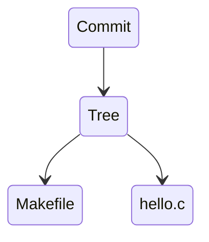

- `git diff` shows **unstaged** changes
	- compares to the last commit if staging area empty (if haven't `git add`ed)
	- `git diff --cached` shows **staged** changes

## Branching
```shell
git branch dev
```
Creates a new branch `dev` that diverges from `main`
- Merge to `main` when the `dev` branch is ready

- `git branch` to list all branches
- `git switch dev` switches to branch `dev`

When we make some changes to `hello.c` on the `dev` branch and commit, `dev` is **ahead** of `main` by one commit. 
- `HEAD` is the tip of the current branch, where the working directory is

`git log` lists all commits that are in the **current** branch, not other branches

### Merge
Every commit (except the root) has a *parent*. Sometimes you have two parents
```shell
# inside main branch
git merge dev
```

- If there's a **conflict**, you need to resolve the conflict
Now `git log`, you'll see a new **merge** commit
- `git log --graph`
- The merge commit has **two** parent commits. `git log` will show the commits on `dev` because they are now reachable
After merging with `main`, `dev` is still here
- The merge is not shown in the log of `dev`

### Detached `HEAD`
`HEAD` does not always refer to the *tip* of some branch. It means what you are looking at **right now**
- stored in `.git/HEAD` file
```shell
git switch --detach <commit>
```
- If `git log`, you'll see only the changes up to that point
- If `git status`, it tells "HEAD detached at <>"

You can make commits from that detached head, without branching
- You can make this into a branch later
- But if you switch **before** making into branch, they will be deleted

## Git objects
`.git`: a directory containing all files and metadata
Store file contents and metadata (commit)
- Name: SHA-1 hash of their contents, unique digital footprint
	- `git hash-object hello.c` hashes the `hello.c`
```shell
tree .git/objects/
```

- `git cat-file -t <hash>` tells the *type* of the file
- `-p` prints the content of the file to human readable format
	- Pointer to a **tree** object: git's internal representation of a directory's contents
	- Pointer to the **parent** object

Tree object:
```shell
git cat-file -p <tree>
# 100644 blob 80c5b23a2ed852b4d5afd76dde6b85e321e13ce3    hello.c
```
- `blob`: content

If a commit didn't do anything with `Makefile`, its `tree` will point to the *same* file blob
- Git only stores one version once
- If the content changes (`hello.c`), Git will create an **entire** new blob
	- Git will periodically *pack* similar objects to save space

### Subdirectories
When subdirectories are created, cd's `tree` object will also point to the `tree` of the subdir.
- If same file content in both directories, their `tree`s will point to the same object.

### Index
Staging revisited
`git ls-files` lists all files being tracked by Git
`git ls-files --stage` shows all what to be in `.git/index` if there's nothing in the staging area
```shell
git ls-files --stage
# 100644 850742712c6609bf85aecca7c24c2eebf4d89b0a 0	Makefile
# 100644 9b1d2628d4bfb5cd74a2c7138ce0572a89676554 0	hello.c
# 100644 8baef1b4abc478178b004d62031cf7fe6db6f903 0	subdir/notes.txt
```
Staging areas has all the files in the repository, and their hashes

Now modify `hello.c`
```shell
git diff
diff --git a/hello.c b/hello.c
index 6aa1b98..c9f149c 100644
--- a/hello.c
+++ b/hello.c
```
`6aa1b98..c9f149c`: Git quickly calculates the new hash. If they are different, Git compares the files. 

By adding the file, Git creates a blob
- When a version of the file is in index/staging, you still have the version in the file system, only referred to by the `index` file.

### References
- `.git/refs/heads` contains files named after branches
	- Each file is the hash of the latest commit on that branch
- `.git/HEAD`: a text file with the **path** to the current `HEAD`
	- Attached: `HEAD` will refer to a **branch** file path, which points to a commit
	- Detached: it will be a *hash* for a commit
To Git, a branch is simply the single latest commit. 
- You can always trace back to its parent. 

## GitHub
Website to host your repo
`git clone <old> <new>`
Push pull are clumsy.
- Create a central, shared repo between people. Each person push and pulls from it.

### Setup
Copy the SSH URL, uniquely representing this GitHub repo
```shell
git clone git@github.com:mgongd/centralrepo.git
```

Add this GitHub repo as a remote repo named `origin`
```shell
git remote add origin git@github.com:mgongd/centralrepo.git
```
- `git remote` will return "origin"
- as if the central repo comes there by cloning

For the first push, need to associate local main branch with a **remote branch**
```shell
git push --set-upstream origin main
```
- `git push` will be fine for subsequent pushes

In `.git/config`, Git tracks the remote origin stuff.

After making another change and commit, on GitHub, the `origin/master` branch is behind.
- *Remote* `main` branch pointer is in `.git/refs/remotes/origin/main`

### Collaboration
As a teammate, 
1. `git clone` the repo
2. Create and switch to a new branch `git switch dev`
3. Make some changes
4. `git push -u origin dev` (`-u` is shorthand)
5. Create a <span style="color:rgb(255, 0, 0)">pull request</span>. Request review from others
	- Alternatively, you can merge `dev` with `main` **locally** and push from `main` to GitHub
6. Once agreement, merge the branch and close the request
	- **Create a merge commit**: similar to local
	- **Squash and merge**: get rid of the intermediate branches, creates a meta commit containing all changes in that branch. Just preserve the end result
	- **Rebase and merge**: If `main` has moved ahead, take the `dev` change, appending them after the `main` changes, pretend you make them later on (fast forward `main`)
7. Go back to master, and `git pull`