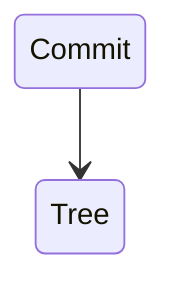
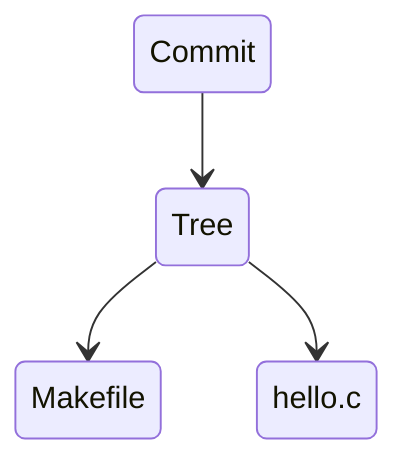
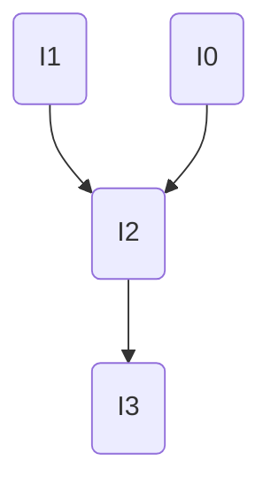

# Note-Taking Style Guide

This document captures the markdown note-taking style used across this site's class notes, extracted for AI agents to replicate.

---

## File Structure

Every note file must begin with YAML front matter:

```yaml
---
title: "5 File IO"
permalink: /articles/asp/5
date: 2025-01-20        # optional
author: "Ming Gong"     # optional, for collaborative posts
---
```

Immediately after front matter, include the TOC partial for longer notes:

```

```

---

## Headings

- `#` (H1): Major topic sections. Used sparingly — typically one H1 per conceptual unit within a page.
- `##` (H2): Subsections within a topic.
- `###` (H3): Sub-subsections, for tightly scoped details.
- Headings are **telegraphic** — not full sentences. Omit articles: write `## Merge`, not `## The Merge Operation`.
- API/function names in headings use backtick code: `## \`malloc()\` and \`free()\``

---

## Prose Style

- **Dense, lecture-note fragments.** Skip filler words. Write "Returns pointer to payload, NOT block" not "This function returns a pointer to the payload, not the beginning of the block."
- Start statements as direct facts: "32 bit: each program uses 3G bottom."
- Implication chains use bullet sub-points, not multi-sentence paragraphs.
- First person is acceptable for personal recommendations or design decisions: "I recommend...", "We chose..."
- Colloquial tone is fine when appropriate: "RIP, got 4 errors.", "CONGRATS on completing 1/3 of this assignment!"
- Use `E.` as shorthand for "Example" inline: `E. if tree has 5 levels, need 5 reads`
- Use `Q:` for inline questions in example blocks.

---

## Emphasis

| Syntax | Use |
|--------|-----|
| `**bold**` | Key technical terms, critical values, important constraints, warning words |
| `*italic*` | Softer emphasis, quoted terms, lighter stress than bold |
| `` `code` `` | All function names, syscalls, commands, flags, file paths, variable names, register names, constants |
| `<span style="color:rgb(255, 0, 0)">text</span>` | Maximum emphasis — the most critical term or value in a sentence |
| `<span style="color:rgb(0, 176, 240)">text</span>` | Secondary emphasis — related term that needs to stand out but is less critical |

Bold is used heavily. Do not over-use italics or colored spans — reserve them for terms that genuinely need to pop.

---

## Lists

Use dashes (`-`) for bullet lists. Use numbers for sequential steps.

Bullet lists are used for:
- Enumerating properties or behaviors
- Adding sub-notes or caveats to a preceding statement
- Summarizing multiple items

Nested bullets use one tab of indentation:

```markdown
- **External fragmentation**: memory is in pieces, can't allocate large blocks
	- Real allocators delay coalescing to save computation
```

Lists often appear without a colon or full sentence before them — they are continuation-style notes. Do not end list items with periods unless the item is a full sentence.

---

## Code Blocks

Always use fenced code blocks with a language tag:

````markdown
```c
void *malloc(size_t size) { ... }
```

```shell
git diff --cached
```


````

Common tags: `c`, `shell`, `python`, `mermaid`, `asm`/`assembly`, plain (no tag) for pseudocode or memory layouts.

Code blocks include complete, runnable snippets when possible. Truncation with `// ...` is acceptable for long middle sections, but keep the context intact.

---

## Separator Rules

Use `---` (horizontal rule) to separate major sections, especially at the start of a new H1 section:

```markdown
---
# Git Objects
```

This creates a visual break before each major topic and is used consistently throughout the lecture notes.

---

## Notice Boxes (Callouts)

Use Jekyll's notice classes for callout boxes. They are written as a blockquote followed by a `{: .notice--type}` tag on the **next line**:

```markdown
> Run DRC **as frequently as possible**, especially if you are a beginner!!
{: .notice--warning}

> We are now **DRC clean!**
{: .notice--success}

> Take a read of Shepard's Online CAD Tutorial.
{: .notice--info}

> Do a **C+CC** extraction only. RCC might crash Cadence
{: .notice--danger}
```

| Class | Color | Use |
|-------|-------|-----|
| `notice--info` | Blue | Tips, additional context, optional reading |
| `notice--warning` | Orange | Pitfalls, cautions, common mistakes |
| `notice--success` | Green | Prerequisites met, confirmations, celebrations |
| `notice--danger` | Red | Critical warnings, data-loss risks |

Multi-line notices use `\n` line breaks or multi-line blockquote syntax. You can put **bold**, `code`, and links inside notices normally.

---

## Images

Standard image:
```markdown

```

Alt text is typically empty or just `alt`. The path is absolute from site root.

Centered with Jekyll attribute:
```markdown
{: .align-center}
```

Constrained size (HTML):
```html

```

Images are placed immediately after the text they illustrate, with no blank line between the text and the image.

---

## Math (LaTeX)

Inline math uses `$$...$$` (double dollar signs, not single):
```markdown
$$t_{clk}(k) = \frac L k + o$$
```

Block math also uses `$$...$$` on its own line:
```markdown
$$d' = d\times m \pm 2^k$$
```

Subscripts: `$$t_{RCD}$$`, `$$2^N$$`, `$$log_2$$`

---

## Mermaid Diagrams

Use mermaid code blocks for flowcharts and state diagrams:

````markdown

````

````markdown

````

---

## Blockquotes

Plain `>` blockquotes are used for:
- Examples: `> E. DRAM bus runs at 2400 MHz. What is the peak bandwidth?`
- Questions: `> Q: How many lookups happen in L2?`
- Asides and external quotes

Notice boxes (see above) are a specialized use of blockquotes.

---

## Series Navigation

For multi-part article series, place a numbered navigation list at the top of the page (below front matter and TOC), with the **current page bolded**:

```markdown
1. [Intro](/articles/vlsi)
2. **Inverter**
3. [Project Plan](/articles/vlsi/floorplan)
4. [Adder and Shifter](/articles/vlsi/adder)
5. [SRAM](/articles/vlsi/sram)
```

---

## Internal Linking

- Link to other articles: `[Memory](/articles/asp/2)`
- Link to a specific section anchor: `[Diffusion Sharing](/articles/vlsi/adder#3-diffusion-sharing)`
- Inline parenthetical references: `(see [ASP Notes](/courses/asp))`
- Anchor IDs are auto-generated from headings as lowercase-with-hyphens: `## Body Vias` → `#body-vias`

---

## Homework Sections

Homework notes are appended at the bottom of their relevant article as a top-level `# HW X` section:

```markdown
---
# HW 1
## Padding
...
## Bitfield
...
```

This keeps HW notes co-located with lecture material but clearly separated.

---

## Overall Tone

- Direct and confident. No hedging.
- Technical terms are introduced in **bold** on first use.
- Examples are concrete, often using real numbers or small code snippets.
- Personal voice is allowed — opinions on pedagogy, tool frustrations, and design trade-offs are written naturally.
- Unfinished sections or uncertain points are noted inline with `???` or a brief comment rather than omitted.
