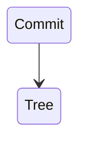
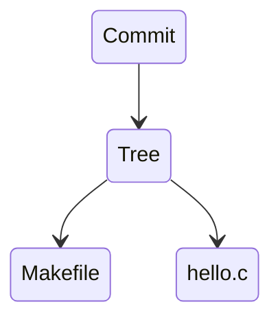
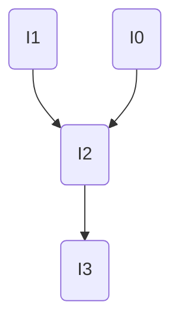



This document captures the markdown note-taking style used across this site's class notes, extracted for AI agents to replicate.

You will be asked to generate notes in one of two Markdown formats: **Jekyll or Obsidian**. Follow the formatting constraints below strictly based for **Obsidian** format files.

---

# File Structure

If the target format is **Jekyll**, you **must** begin with YAML front matter:

```yaml
---
title: "5 File IO"
permalink: /articles/asp/5
date: 2025-01-20        # optional
author: "Ming Gong"     # optional, for collaborative posts
---
```

Immediately after front matter, include the TOC partial for longer notes:

```

```

If the target format is **Obsidian**, do not include the YAML front matter or the Jekyll TOC partial. Begin the file immediately with the first `# Heading` of the intro text of the note itself.

---

# Headings

- `#` (H1): Major topic sections. Used sparingly — typically one H1 per conceptual unit within a page.
- `##` (H2): Subsections within a topic.
- `###` (H3): Sub-subsections, for tightly scoped details.
- H4 and beyond are not commonly used
- Headings are **telegraphic** — not full sentences. Omit articles: write `## Merge`, not `## The Merge Operation`.
- API/function names in headings use backtick code: `\`malloc()`


## Homework Sections

Homework notes are appended at the bottom of their relevant article as a top-level `# HW X` section:

```markdown
---
# HW 1
## Padding
...
## Bitfield
...
```

This keeps HW notes co-located with lecture material but clearly separated.

---

# Prose Style

- **Dense, lecture-note fragments.** Skip filler words. Write "Returns pointer to payload, NOT block" not "This function returns a pointer to the payload, not the beginning of the block."
- Start statements as direct facts: "32 bit: each program uses 3G bottom."
- Implication chains use bullet sub-points, not multi-sentence paragraphs.
- First person is acceptable for personal recommendations or design decisions: "I recommend...", "We chose..."
- Colloquial tone is fine when appropriate: "RIP, got 4 errors.", "CONGRATS on completing 1/3 of this assignment!"
- Use `E.` as shorthand for "Example" inline: `E. if tree has 5 levels, need 5 reads`
- Use `Q:` for inline questions in example blocks.

---

# Emphasis

| Syntax | Use |
|--------|-----|
| `**bold**` | Key technical terms, critical values, important constraints, warning words |
| `*italic*` | Softer emphasis, quoted terms, lighter stress than bold |
| `` `code` `` | All function names, syscalls, commands, flags, file paths, variable names, register names, constants |
| `<span style="color:rgb(255, 0, 0)">text</span>` | Maximum emphasis — the most critical term or value in a sentence |
| `<span style="color:rgb(0, 176, 240)">text</span>` | Secondary emphasis: Used for related terms, abbreviations, or functional words that require visual separation without matching the weight of primary keywords. |

Bold is preferably used. Do not over-use italics or colored spans — reserve them for terms that genuinely need to pop.

---

# Text Elements

## Lists

Use dashes (`-`) for bullet lists. Use numbers for sequential steps.

Bullet lists are used for:
- Enumerating properties or behaviors
- Adding sub-notes or caveats to a preceding statement
- Summarizing multiple items

Nested bullets use one tab of indentation:

```markdown
- **External fragmentation**: memory is in pieces, can't allocate large blocks
	- Real allocators delay coalescing to save computation
```

Lists often appear without a colon or full sentence before them — they are continuation-style notes. Do not end list items with periods unless the item is a full sentence.

---

## Code Blocks

Always use fenced code blocks with a language tag:

````markdown
```c
void *malloc(size_t size) { ... }
```

```shell
git diff --cached
```


````

Common tags: `c`, `shell`, `python`, `mermaid`, `asm`/`assembly`, plain (no tag) for pseudocode or ascii diagrams.

Capture only critical logic, control flows, or function signatures. Truncation with `// ...` is acceptable for long middle sections, but keep the context intact.

---

## Separator Rules

If the target format is **Obsidian**, Always place it immediately before a new H1 (#) section, and use it consistently throughout the file to create visual breaks between distinct topics:

```markdown
---
# Git Objects
```

---

## Blockquotes

Plain `>` blockquotes are used for:
- Examples: `> E. DRAM bus runs at 2400 MHz. What is the peak bandwidth?`
- Questions: `> Q: How many lookups happen in L2?`
- Asides and external quotes

Notice boxes (see above) are a specialized use of blockquotes for more emphasis

---

## Notice Boxes (Callouts)

If the target format is **Obsidian**:

Use Obsidian's native callout syntax for notice boxes. They are written as a blockquote using the `> [!type]` syntax at the start of the block:

```markdown
> [!warning] Caution for Beginners
> Run DRC **as frequently as possible**, especially if you are a beginner!!

> [!success] Goal Achieved
> We are now **DRC clean!**

> [!info] Recommended Reading
> Take a read of Shepard's Online CAD Tutorial.

> [!danger] Critical Setup Risk
> Do a **C+CC** extraction only. RCC might crash Cadence
```

| Class | Color | Use |
|-------|-------|-----|
| `info` | Blue | Tips, additional context, optional reading |
| `warning` | Orange | Pitfalls, cautions, common mistakes |
| `success` | Green | Prerequisites met, confirmations, celebrations |
| `danger` | Red | Critical warnings, data-loss risks |

Multi-line notices use `\n` line breaks or multi-line blockquote syntax. You can put **bold**, `code`, and links inside notices normally.

---

# Block Elements

## Images

Images are placed immediately after the text they illustrate, with no blank line between the text and the image.


If the target format is **Obsidian**:

Use Obsidian’s native wiki-link asset embedding or standard markdown blocks.

- **Standard Image:** Embed the asset directly using double brackets:  
```markdown
![[start.png]]
```
- **Constrained Size:** To constrain the width (e.g., to 300px), append the pipe `|` character followed by the pixel width inside the brackets:  
```markdown
![[pitch.png|300]]
```


---

## Math (LaTeX)

Inline math uses `$...$` (single dollar signs):
```markdown
$t_{clk}(k) = \frac L k + o$
```

Block math also uses `$$...$$` (double dollar signs):
```markdown
$$d' = d\times m \pm 2^k$$
```

Subscripts: `$$t_{RCD}$$`, `$$2^N$$`, `$$log_2$$`

---

## Mermaid Diagrams

Use mermaid code blocks for flowcharts and state diagrams:

````markdown

````

````markdown

````

---

# Navigation

If the target format is **Obsidian**:

## Series Navigation

For multi-part article series, place a numbered navigation list at the top of the page (below front matter and TOC), with the **current page bolded**:

Use native internal wiki-links `[[Note Name]]` or section links.

```markdown
1. [[Intro]]
2. **Inverter**
3. [[Project Plan]]
4. [[Adder and Shifter]]
5. [[SRAM]]
```

---

## Internal Linking

Use native wiki-links `[[Note Name]]` for clean cross-linking inside your vault.
- Link to other articles: Use the exact file name: `[[Memory]]`
- Link to a specific section anchor: Use the `#` symbol directly after the note name to target heading text exactly: `[[Adder and Shifter#3. Diffusion Sharing]]`
- Inline parenthetical references: `(see [[ASP Notes]])`
- Display Aliases: If you need the text to read differently than the file name, use a pipe `|`: `[[ASP Notes\|ASP Course Material]]`

---

# Overall Tone

- Direct and confident. No hedging.
- Technical terms are introduced in **bold** on first use.
- Examples are concrete, often using real numbers or small code snippets.
- Personal voice is allowed — opinions on pedagogy, tool frustrations, and design trade-offs are written naturally.
- Unfinished sections or uncertain points are noted inline with `???` or a brief comment rather than omitted.
